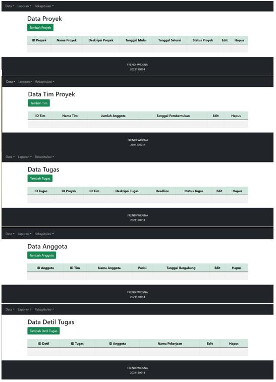

# 💼 IT Project & Team Management System

Aplikasi berbasis **Laravel** untuk membantu pengelolaan proyek, tim, dan tugas dalam suatu organisasi IT.  
Sistem ini dirancang untuk memudahkan pemantauan aktivitas proyek, alokasi tugas, serta penyusunan laporan secara terstruktur dan efisien.

---

## 🎯 Tujuan Proyek
Sistem ini dikembangkan untuk menggantikan pencatatan manual dalam pengelolaan proyek dan tim.  
Dengan sistem berbasis web, seluruh data dapat diakses secara terpusat, akurat, dan mudah diperbarui kapan pun diperlukan.

---

## ✨ Fitur Utama
- **Manajemen Proyek** — menambah, memperbarui, dan menghapus data proyek.  
- **Manajemen Tim & Anggota** — mencatat anggota yang terlibat dalam setiap proyek.  
- **Manajemen Tugas (Task Management)** — mengatur tugas-tugas dalam proyek dan status penyelesaiannya.  
- **Laporan dan Rekap** — menampilkan hasil pekerjaan serta rekap proyek aktif.  
- **Validasi Data & Relasi Tabel** — menjaga integritas data antar entitas proyek, tim, dan tugas.  

---

## 🧩 Teknologi yang Digunakan
- **Framework:** Laravel  
- **Bahasa Pemrograman:** PHP, JavaScript  
- **Basis Data:** MySQL  
- **Frontend:** Blade Template, Bootstrap  
- **Environment:** Laragon  
- **Version Control:** Git & GitHub  

---

## 🗃️ Skema Database

Berikut adalah diagram relasi antara entitas utama dalam sistem:

Diagram ini menunjukkan relasi antar tabel seperti:
- Satu **project** dapat memiliki banyak **tasks**  
- Satu **task** terhubung dengan satu atau lebih **members**  
- **Teams** terdiri dari beberapa **members** yang bekerja dalam satu atau beberapa proyek  

---

## 📸 Tampilan Antarmuka

| Halaman Data | Halaman Laporan |
|---------------|----------------|
|  |  |

| Halaman Rekap |
|----------------|
|  |

---

## 🧠 Konsep dan Arsitektur
Aplikasi ini menerapkan pola **MVC (Model–View–Controller)** untuk memisahkan antara logika bisnis, pengolahan data, dan tampilan.  
Pendekatan ini memudahkan proses pengembangan, debugging, serta kolaborasi antar anggota tim.

---

## 👨‍💻 Pengembang
**Frendi Widsna**  
📍 Bandung, Indonesia  
📧 [frendiwidsna16@gmail.com](mailto:frendiwidsna16@gmail.com)  
🔗 [LinkedIn](https://www.linkedin.com/in/frendi-widsna-36b000267) | [GitHub](https://github.com/FingrenF)
